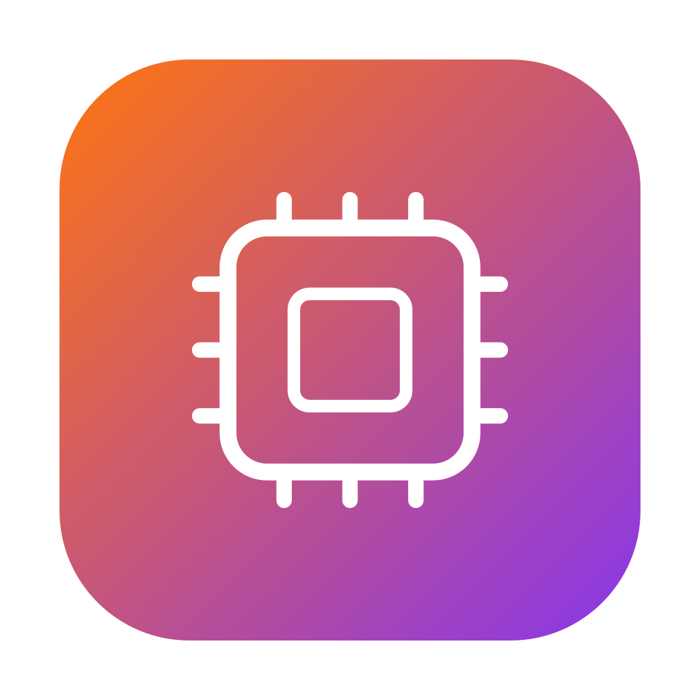
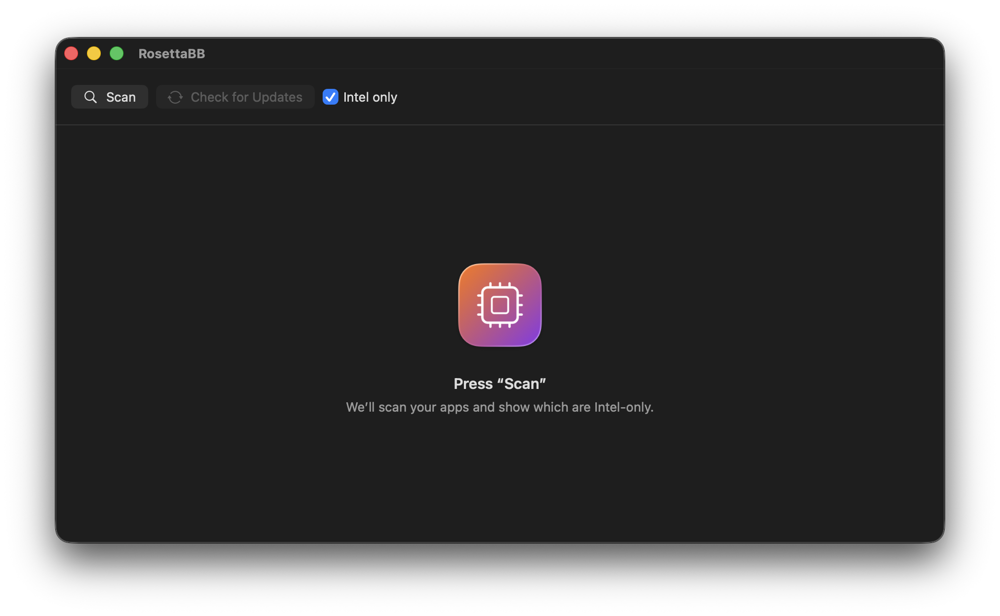

<p align="center">
  
</p>

<h1 align="center">RosettaBB</h1>

<p align="center">
  <a href="https://github.com/proterian/RosettaBB/releases/latest"></a>
  <a href="LICENSE"></a>
  <a href="https://github.com/proterian/RosettaBB/releases/latest"></a>
</p>

<p align="center"><a href="README.md">English</a> · <b>Русский</b></p>

Утилита для Apple Silicon Mac: сканирует установленные приложения и показывает,
какие из них **Intel-only** — то есть требуют Rosetta и перестанут работать,
начиная с macOS 28 (см. [Apple Support 102527](https://support.apple.com/ru-ru/102527)).

<p align="center">
  
</p>

## Возможности

- Сканирует `/Applications`, `/Applications/Utilities` и `~/Applications`.
- Читает Mach-O-заголовок главного бинарника каждого `.app`.
- Классифицирует: **Intel** / **Universal** / **Apple**.
- Фильтр «только Intel», счётчики, «Показать в Finder».
- Проверка обновлений для Intel-приложений (App Store, Sparkle appcast,
  Homebrew Cask) — по кнопке, статус прямо в строке списка.
- Локализованный интерфейс: английский и русский (по языку системы).

## Скачать

Возьмите последний **RosettaBB.dmg** со страницы
[Releases](https://github.com/proterian/RosettaBB/releases/latest) и перетащите
приложение в Applications. Приложение не нотаризовано, поэтому при первом запуске:
правый клик → **«Открыть»**. Требуется macOS 14+ (Apple Silicon).

## Сборка и запуск

Требуется macOS 14+ и Swift 6 (Xcode 16+).

```bash
swift run RosettaBB
```

## Тесты

```bash
swift test
```

## Сборка приложения и DMG

```bash
bash scripts/generate-icons.sh   # один раз: иконки из Assets/
bash scripts/package-dmg.sh      # → dist/RosettaBB.app и dist/RosettaBB-1.0.dmg
```

Бандл подписывается ad-hoc (требование запуска arm64); без сертификата
Developer ID и нотаризации подписывать для широкой раздачи смысла нет.

## Архитектура

- `RosettaBBCore` — чистое ядро без UI: `MachOInspector` (парсинг Mach-O),
  `AppScanner` (обход файловой системы), `AppClassifier` (вердикт). Покрыто тестами.
- `RosettaBB` — SwiftUI-оболочка: `ScanViewModel` + `ContentView`.

## Лицензия

[MIT](LICENSE).
